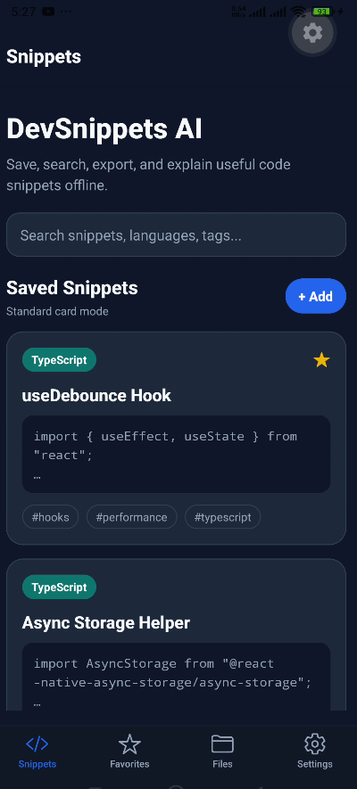
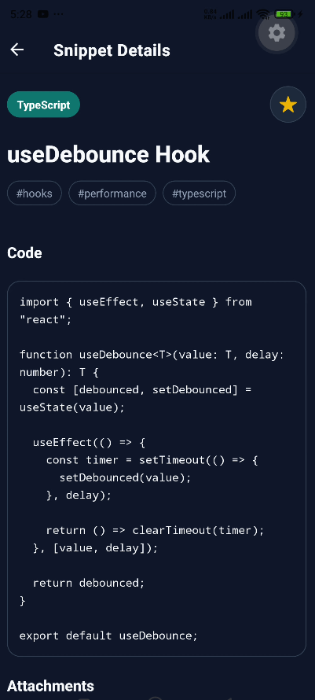
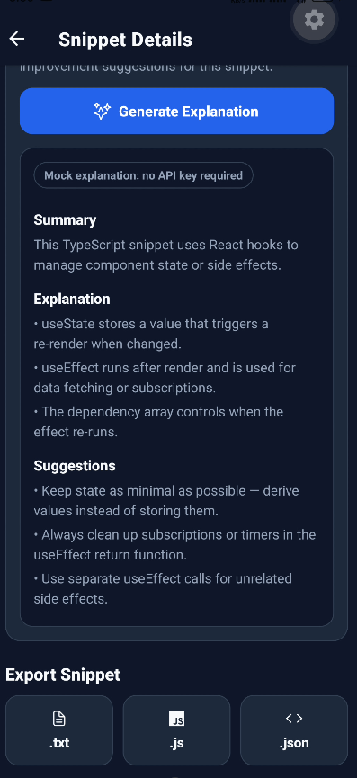
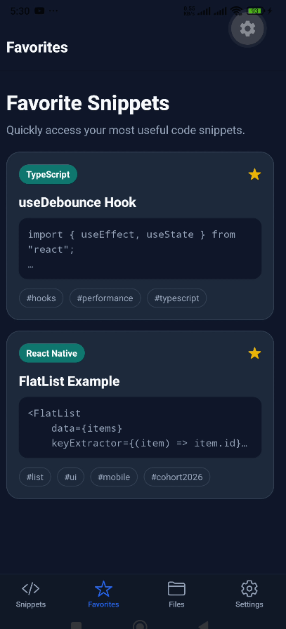
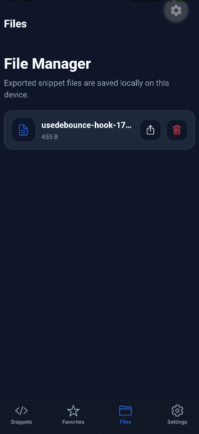
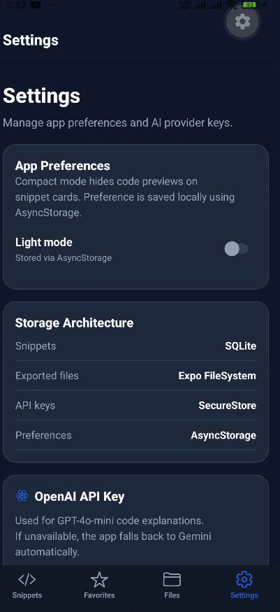
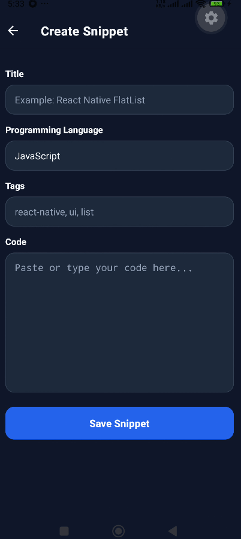

# DevSnippets AI

A modern offline-first developer utility app built with Expo, React Native, and TypeScript. Save, organize, search, export, and understand code snippets directly on your device — no internet required for core functionality.

Built for the Mobile Development Cohort 2026 peer review assignment.

---

## Screenshots

| Home | Snippet Details01 | Snippet Details02 |AI Explanation |
|---|---|---|---|
|  |  |  |  |

| Favorites | File Manager | Settings | Create Snippet |
|---|---|---|---|
|  |  |  |  |

---

## Features

**Snippet Management**
- Create, edit, and delete code snippets
- Search by title, language, tags, or code content
- Mark snippets as favorites
- Attach screenshots to snippets

**Offline Storage**
- All snippets stored locally in SQLite
- Full CRUD works without internet
- Data persists across app restarts

**File Management**
- Export snippets as `.txt`, `.js`, or `.json`
- Browse exported files in the File Manager
- Share exported files with other apps
- Delete files from local storage

**AI Code Explanation**
- OpenAI (gpt-4o-mini) as primary AI provider
- Gemini (gemini-1.5-flash) as automatic fallback
- Mock explanation fallback when no API key is saved
- AI keys stored securely via SecureStore — never hardcoded

**Settings**
- Save OpenAI and Gemini API keys separately
- Compact snippet card mode preference
- Dark/light theme preference
- All preferences persisted via AsyncStorage

---

## Tech Stack

| Tool | Purpose |
|---|---|
| Expo SDK 55 | App framework |
| React Native | UI layer |
| TypeScript | Language |
| Expo Router | File-based navigation |
| expo-sqlite | Snippet database |
| expo-file-system | Local file management |
| expo-sharing | File sharing |
| expo-secure-store | API key storage |
| expo-image-picker | Screenshot attachments |
| expo-image | Image display |
| AsyncStorage | App preferences |
| React Native StyleSheet | UI styling |

---

## Storage Architecture

| Data | Storage | Reason |
|---|---|---|
| Snippets | SQLite | Structured, queryable, offline |
| Snippet attachments | Expo FileSystem | Binary/image files |
| Exported files | Expo FileSystem | User-accessible documents |
| OpenAI API key | SecureStore | Sensitive credential |
| Gemini API key | SecureStore | Sensitive credential |
| Compact card mode | AsyncStorage | Simple preference |
| Theme preference | AsyncStorage | Simple preference |

---

## Database Structure

SQLite database: `devsnippets.db`

```sql
CREATE TABLE IF NOT EXISTS snippets (
  id          INTEGER PRIMARY KEY AUTOINCREMENT,
  title       TEXT NOT NULL,
  code        TEXT NOT NULL,
  language    TEXT NOT NULL,
  tags        TEXT DEFAULT '',
  isFavorite  INTEGER DEFAULT 0,
  createdAt   TEXT NOT NULL,
  updatedAt   TEXT NOT NULL
);

CREATE TABLE IF NOT EXISTS snippet_files (
  id          INTEGER PRIMARY KEY AUTOINCREMENT,
  snippetId   INTEGER NOT NULL,
  fileName    TEXT NOT NULL,
  fileUri     TEXT NOT NULL,
  fileType    TEXT DEFAULT '',
  createdAt   TEXT NOT NULL,
  FOREIGN KEY (snippetId) REFERENCES snippets(id) ON DELETE CASCADE
);
```

`snippet_files` uses a foreign key with `ON DELETE CASCADE` — when a snippet is deleted, its attachments are automatically removed from the database.

---

## Offline-First Approach

The app is designed so that all core features work without an internet connection:

- Snippets are read and written directly to SQLite using synchronous queries
- Search runs as a local SQL `LIKE` query across title, code, language, and tags
- Favorites are stored as a column in the snippets table
- Exported files are written to the device's document directory
- App preferences are stored in AsyncStorage and loaded on focus

AI explanation is the only feature that requires internet. It is treated as an optional enhancement — if both API keys are unavailable or the network fails, the app falls back to a local mock explanation automatically.

---

## File Management

Exported files are saved inside the app's document directory:

```
devsnippets-exports/               <- snippet exports (.txt, .js, .json)
devsnippets-exports/attachments/   <- screenshot attachments
```

The File Manager screen lists all exported files with name and size. Files can be shared via the native share sheet or deleted individually.

---

## AI Integration Workflow

AI explanation is triggered from the Snippet Details screen.

**Call chain:**
```
1. Read OpenAI key from SecureStore
   -> if found: call OpenAI gpt-4o-mini
   -> if fails: try next

2. Read Gemini key from SecureStore
   -> if found: call Gemini gemini-1.5-flash
   -> if fails: try next

3. Return local mock explanation
```

Both providers are prompted to return a strict JSON response:

```json
{
  "summary": "one sentence description",
  "explanation": ["point 1", "point 2", "point 3"],
  "suggestions": ["suggestion 1", "suggestion 2", "suggestion 3"]
}
```

The UI displays the provider badge (OpenAI / Gemini / Mock) alongside the explanation so the user knows which source was used.

API keys are stored using `expo-secure-store` and read at call time — never hardcoded or logged.

---

## Screens

| Screen | Path |
|---|---|
| Snippets (Home) | `app/(tabs)/index.tsx` |
| Favorites | `app/(tabs)/favorites.tsx` |
| File Manager | `app/(tabs)/files.tsx` |
| Settings | `app/(tabs)/settings.tsx` |
| Snippet Details | `app/snippet/[id].tsx` |
| Create Snippet | `app/snippet/create.tsx` |
| Edit Snippet | `app/snippet/edit.tsx` |

---

## Project Structure

```
src/
├── app/
│   ├── (tabs)/
│   │   ├── _layout.tsx
│   │   ├── index.tsx
│   │   ├── favorites.tsx
│   │   ├── files.tsx
│   │   └── settings.tsx
│   ├── snippet/
│   │   ├── [id].tsx
│   │   ├── create.tsx
│   │   └── edit.tsx
│   ├── _layout.tsx
│   └── index.tsx
├── components/
│   ├── CodeBox.tsx
│   ├── EmptyState.tsx
│   └── SnippetCard.tsx
├── constants/
│   └── colors.ts
├── database/
│   ├── db.ts
│   ├── snippetRepository.ts
│   └── fileRepository.ts
├── hooks/
│   └── useTheme.ts
├── services/
│   ├── aiService.ts
│   ├── exportService.ts
│   ├── fileService.ts
│   ├── preferencesService.ts
│   └── secureStoreService.ts
└── types/
    └── snippet.ts
```

---

## How to Run

```bash
# Install dependencies
npm install

# Start Expo dev server
npx expo start --clear
```

Scan the QR code with Expo Go on your phone.

To use AI explanation, go to Settings and save an OpenAI or Gemini API key. Both keys can be saved simultaneously — OpenAI is used first, Gemini as fallback. If neither key is saved, the app uses a built-in mock explanation.

---

## UI

Dark developer-focused theme throughout. Color palette uses blue, teal, slate, green, yellow, and red only & no pink, purple, or orange.
